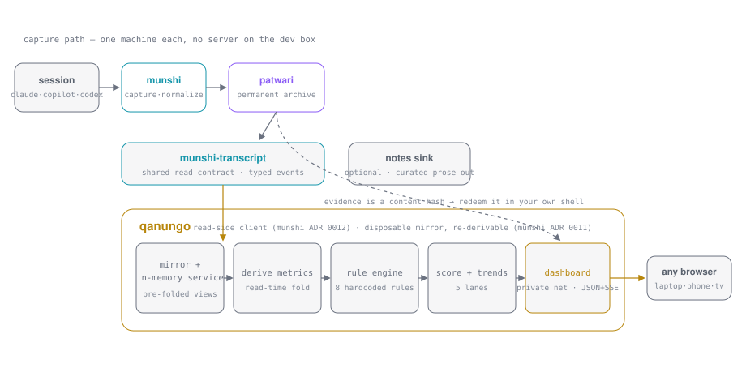
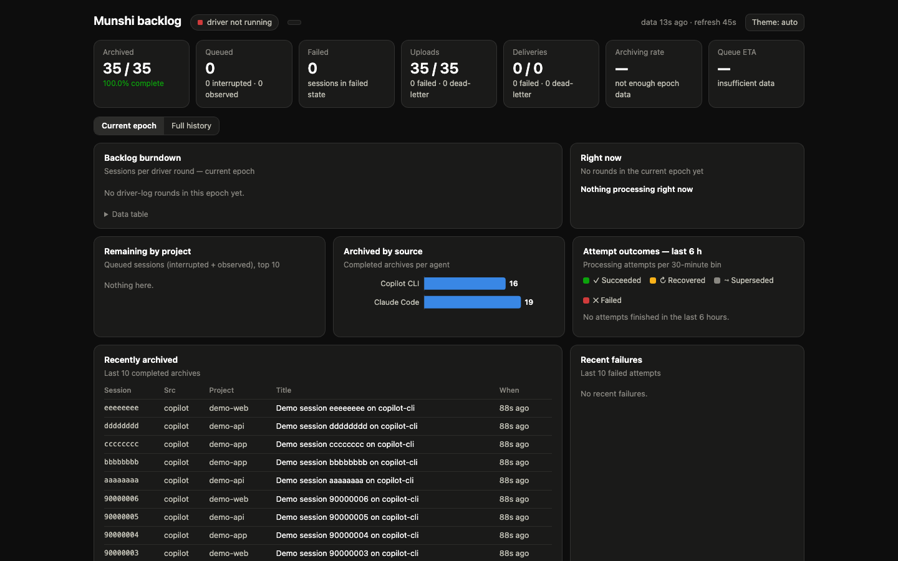
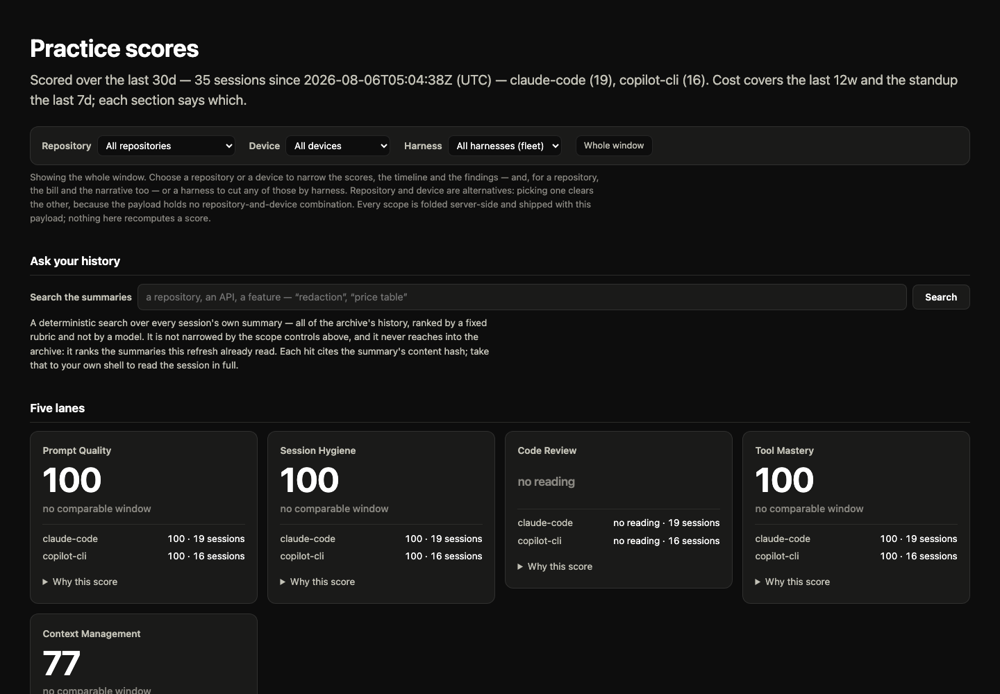
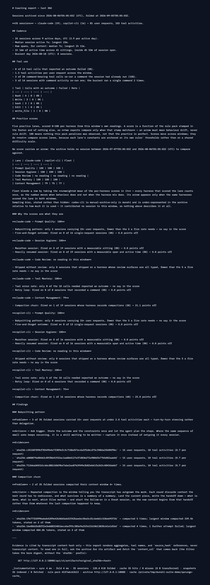

# daftar

*Munshi writes the record; Patwari keeps the archive; Qanungo audits it.*

**daftar** is the front door for a three-tool suite that turns your AI-coding sessions into a
permanent archive and then into coaching you can act on.

- **Capture every session** — Claude Code and GitHub Copilot CLI archive themselves through the
  harness's own lifecycle hooks; OpenAI Codex CLI transcripts are archived by hand.
- **Keep it permanently and verifiably** — one self-hosted archive server holds the verbatim
  transcript, every summary revision, and oversized tool outputs as content-addressed,
  hash-verified, immutable snapshots.
- **Read it back** — practice scores, anti-pattern findings, a standup, a token/cost breakdown,
  plain-language search over your own history, an instructions doctor, and a skill finder.
- **CLI plus a private web dashboard** — no VS Code, no extension, readable from a laptop, a
  phone or a TV.
- **LLM-free core** — one model call summarizes each session at capture time, and nothing else.
  Every score, rule, dollar and finding downstream is deterministic arithmetic you can recompute.

## Trust

**There is no authentication anywhere in this suite, and that is a design decision rather than an
oversight.** It was built as one person's private tooling for their own LAN and tailnet, where
every client that can reach the archive is already trusted. Munshi sends its snapshots with no
credential, because the archive has none to ask for. The archive serves raw blobs to anyone who
can open the port. The coaching dashboard refuses nobody and says so out loud in its startup line
when you bind it off loopback. **Run all three on a private network you control, never on the open
internet**, and put your own authenticating proxy in front of anything you publish. None of this
is a judgement about what you should run — anyone is welcome to take this suite and adapt it, and
these are the assumptions you would be adapting. Each repo states its own posture:
[munshi](https://github.com/surdy/munshi#trust-and-authentication) ·
[patwari](https://github.com/surdy/patwari#trust-and-authentication) ·
[qanungo](https://github.com/surdy/qanungo#trust-and-authentication).

## The three tools

| Tool | Role | Runs on | Repo |
| --- | --- | --- | --- |
| **munshi** | Captures each finished session, has a model you choose summarize it, writes durable Markdown, and uploads the full snapshot to the archive | Every machine you code on (macOS, Linux) | [surdy/munshi](https://github.com/surdy/munshi) |
| **patwari** | The central archive server: immutable, content-addressed, hash-verified multi-artifact snapshots, with online backup, verify and restore | One always-on host on your private network | [surdy/patwari](https://github.com/surdy/patwari) |
| **qanungo** | The read side: mirrors the archive, derives everything at read time, and renders reports, a dashboard, and answers | Wherever you read — a laptop is fine | [surdy/qanungo](https://github.com/surdy/qanungo) |



## Install order

Install in this order; each step assumes the one before it exists.

| # | What | Where | Time | Prerequisites |
| --- | --- | --- | --- | --- |
| 1 | **patwari** | One host on your private network (or your laptop, to try it) | ~10 min | Rust 1.96+, `libsqlite3-dev` and `libzstd-dev` to build from source — or an OCI builder and the repo's `Containerfile` for the production image |
| 2 | **munshi** | Every machine you code on | ~15 min per machine | Rust 1.85+; a Claude Code or Copilot CLI install to capture from; a **summarizer executable** (see below); optionally Node 20+ for the desktop app |
| 3 | **qanungo** | Wherever you read | ~5 min | Rust 1.85+, network reach to patwari |

**Running patwari.** `cargo run -p patwari-server` is the whole thing for a local trial — one
process, SQLite metadata, a local blob store, no external dependencies. For a real deployment,
build the image from the repo's `Containerfile` and give it one persistent volume; see
[patwari `docs/self-hosting.md`](https://github.com/surdy/patwari/blob/main/docs/self-hosting.md)
for the volume layout, health checks, backups and recovery.

**The summarizer.** Munshi never calls a model API itself. It pipes each session to an executable
you configure, which reads a JSON request on stdin and prints one JSON object. Two wrappers ship
in the repo — `contrib/claude-summarizer.sh` (`claude -p` with a haiku model) and
`contrib/copilot-summarizer.sh` (Copilot CLI in noninteractive mode) — and either works regardless
of which harness captured the session. Use a wrapper rather than a bare CLI: both `claude -p` and
`copilot -s` record sessions of their own, and un-isolated, archiving starts feeding itself. The
full contract, and the story for authenticating the wrapper's isolated home, is in
[munshi `docs/getting-started.md`](https://github.com/surdy/munshi/blob/main/docs/getting-started.md)
and [`docs/summarizers.md`](https://github.com/surdy/munshi/blob/main/docs/summarizers.md).

## Fifteen minutes to a first report

Everything below runs on one machine, against a patwari on loopback. Substitute your own absolute
paths; `~` is not expanded inside hook files or platform timers.

**1 — start the archive** (in a second terminal; leave it running)

```sh
git clone https://github.com/surdy/patwari.git && cd patwari
cargo run -p patwari-server
curl -i http://127.0.0.1:8080/readyz
```

**2 — build munshi and put it somewhere stable**

Registration records the binary's **absolute path** inside your hook files, so install it before
registering.

```sh
git clone https://github.com/surdy/munshi.git && cd munshi
cargo build --release
mkdir -p ~/.local/bin && cp target/release/munshi ~/.local/bin/munshi
chmod +x /absolute/path/to/munshi/contrib/claude-summarizer.sh
```

On macOS, prefer `./contrib/dev-deploy.sh` over the bare `cp`: a background `munshi`'s folder
permissions are keyed to its codesigning identity, and an ad-hoc-signed binary's identity changes
on every rebuild.

**3 — register, and read the disclosure**

`register` discloses what will be processed and refuses to proceed without an explicit
acceptance. Once registered, summarization is on for every project you work in with a registered
harness, the full transcript goes to your summarizer on every completed session, and v1 does not
redact secrets before summarizing.

```sh
munshi register \
  --accept-transcript-processing \
  --harness claude-code \
  --output-dir /absolute/path/to/munshi-summaries \
  --summarizer /absolute/path/to/munshi/contrib/claude-summarizer.sh
```

Drop `--accept-transcript-processing` and an interactive terminal will make you type `I ACCEPT`.
`--harness` is repeatable (`copilot`, `claude-code`); omitted, it targets every harness whose home
it finds. Add `--dry-run` to see the managed paths first.

**4 — point munshi at the archive**

```sh
munshi archive-upload configure --endpoint http://127.0.0.1:8080
munshi archive-upload enable
```

**5 — restart your coding-agent CLI, then run one session** *(this step is yours — nothing here
can do it for you)*

Both Copilot CLI and Claude Code read hook configuration at session startup, so start a **new**
CLI, do a few minutes of real work in some project, and exit cleanly.

**6 — drain the queue and check it landed**

```sh
munshi tick
munshi archive-upload status
munshi sessions
```

`tick` is one idempotent maintenance sweep — recovery, retries, pending uploads — and prints
nothing when there is nothing to do. Put it on a 15-minute launchd agent or systemd user timer
once you are past the first run.

**7 — read it back**

```sh
git clone https://github.com/surdy/qanungo.git && cd qanungo
cargo build --release
export PATWARI_URL=http://127.0.0.1:8080
cargo run --release -- report --last 7d
cargo run --release -- dashboard
```

`--patwari-url` is required on every qanungo command and also reads `PATWARI_URL`, so export it
once and no lane needs the flag again. The dashboard then serves
**http://127.0.0.1:8878**, re-folding in the background every 5 minutes. One session will not
score much — the scores and findings are about patterns across a window — but the pipeline is
now closed end to end.

## Skills

Each tool ships thin Claude Code skills, five of them read-only, that call the commands for you and
read the output with you. The two that do write files write only your own repo's instruction or
skill files, never the archive, and always show the change first. They are often a friendlier first
contact than the CLI: `/coach` will explain a score, where `qanungo report` only prints one.

| Skill | Repo | Say something like | Wraps | Writes files? |
| --- | --- | --- | --- | --- |
| `session-recall` | munshi | "what happened in that session", "how did we do this before", or hand it a session ID | the notes-vault search API, then the patwari read API for the verbatim transcript | No |
| `ask` | qanungo | "when did I…", "have I ever…", "which session did X", "did we already decide…" | `qanungo ask` | No |
| `coach` | qanungo | "how am I doing", "coach me", "review my AI-coding habits", "why is my X score low" | `qanungo report` | No |
| `standup` | qanungo | "what did I ship", "standup", "what did I work on this week" | `qanungo standup` | No |
| `cost-review` | qanungo | "what does my AI coding cost", "where did the tokens go", "is caching paying off" | `qanungo cost` | No |
| `instructions-editor` | qanungo | "what am I repeating myself about", "what should be in my CLAUDE.md" | `qanungo doctor` | **Yes** — your repo's own `CLAUDE.md` / `AGENTS.md`, proposed as a diff first, under normal permission prompts. Never the archive |
| `skill-finder` | qanungo | "what do I keep doing", "what should be a skill", "what am I retyping every week" | `qanungo flows` | **Yes** — a new `.claude/skills/<name>/SKILL.md` or `.claude/agents/<name>.md`, shown in full before it is written. Never the archive |

**Installing one.** Copy the skill's directory out of `contrib/skills/` into your harness's skills
directory: `~/.claude/skills/<name>/` makes it available everywhere, a project's
`.claude/skills/<name>/` scopes it to that repo. The qanungo skills call `qanungo` with no URL
flag of their own, so `PATWARI_URL` must be exported in the shell they run in — a command that
exits 2 with a missing-archive message means the install is unfinished. `session-recall` likewise
wants the endpoints of your own notes vault and archive exported before it can search.

## Dashboards

Three, deliberately separate: they serve different people, on different machines, at different
trust levels.

**munshi-dashboard** — the operator's view of *one machine's* archiving backlog: what is queued,
what failed, what is in flight, recent attempts and diagnostics. Loopback only, by design.

```sh
cargo build --release -p munshi-dashboard && ./target/release/munshi-dashboard   # http://127.0.0.1:8877
```



**The munshi desktop app** — the same ground in a native window, plus a searchable session list
and per-session actions, and it ships the `munshi` command line inside its own bundle so you can
install both at once. Build with `./contrib/build-gui.sh`; bundles land in
`gui/src-tauri/target/release/bundle/`. See
[munshi `docs/gui.md`](https://github.com/surdy/munshi/blob/main/docs/gui.md).

**The qanungo dashboard** — the coaching view over the *whole* archive, every machine and every
harness: five score cards with trend arrows, the findings under them, a timeline, an hour-of-week
heatmap, the quarter's bill, the week's narrative, an ask box, and a provenance footer. Loopback
by default; `--bind` it to a private-network address to read it from a phone or a TV, and it
prints one line saying that nothing authenticates a caller.

```sh
qanungo dashboard --last 30d                    # http://127.0.0.1:8878
qanungo dashboard --bind 192.0.2.10:8878        # a private-network address, unauthenticated, and it says so
```



*`qanungo report` output, synthetic data:*



## Which doc do I open

| You are | Start here | Then |
| --- | --- | --- |
| **Beginner** — I want my sessions archived | [munshi `docs/getting-started.md`](https://github.com/surdy/munshi/blob/main/docs/getting-started.md) | [munshi `docs/summarizers.md`](https://github.com/surdy/munshi/blob/main/docs/summarizers.md) · [munshi `docs/user-guide.md`](https://github.com/surdy/munshi/blob/main/docs/user-guide.md) · [munshi `docs/troubleshooting.md`](https://github.com/surdy/munshi/blob/main/docs/troubleshooting.md) |
| **Beginner** — I want the coaching | [qanungo README → Install](https://github.com/surdy/qanungo#install) | the `/coach`, `/standup` and `/ask` skills in [qanungo `contrib/skills/`](https://github.com/surdy/qanungo/tree/main/contrib/skills) |
| **Operator** — I run the archive | [patwari `docs/self-hosting.md`](https://github.com/surdy/patwari/blob/main/docs/self-hosting.md) | [patwari `docs/api.md` → Command-line interface](https://github.com/surdy/patwari/blob/main/docs/api.md#command-line-interface) (backup, verify, restore) · [→ Configuration](https://github.com/surdy/patwari/blob/main/docs/api.md#configuration) · [→ Integrity verification](https://github.com/surdy/patwari/blob/main/docs/api.md#integrity-verification) |
| **Operator** — I run capture on several machines | [munshi `docs/user-guide.md`](https://github.com/surdy/munshi/blob/main/docs/user-guide.md) | [munshi `docs/configuration.md`](https://github.com/surdy/munshi/blob/main/docs/configuration.md) · [munshi `docs/dashboard.md`](https://github.com/surdy/munshi/blob/main/docs/dashboard.md) · [munshi `docs/gui.md`](https://github.com/surdy/munshi/blob/main/docs/gui.md) |
| **Power user** — how does capture actually work | [munshi `docs/automatic-archive.md`](https://github.com/surdy/munshi/blob/main/docs/automatic-archive.md) | [munshi `docs/harness-adapters.md`](https://github.com/surdy/munshi/blob/main/docs/harness-adapters.md) · [munshi `docs/manual-archive.md`](https://github.com/surdy/munshi/blob/main/docs/manual-archive.md) |
| **Power user** — what is in the archive, and how do I read it | [patwari `CONTEXT.md`](https://github.com/surdy/patwari/blob/main/CONTEXT.md), then [`docs/domain.md` → Domain model](https://github.com/surdy/patwari/blob/main/docs/domain.md#domain-model) | [patwari `docs/api.md` → API v1](https://github.com/surdy/patwari/blob/main/docs/api.md#api-v1) · [→ Multi-artifact manifest v1](https://github.com/surdy/patwari/blob/main/docs/api.md#multi-artifact-manifest-v1) · [`docs/domain.md` → Retrieval and analysis access](https://github.com/surdy/patwari/blob/main/docs/domain.md#retrieval-and-analysis-access) |
| **Power user** — what do the scores and rules mean | [qanungo README](https://github.com/surdy/qanungo#readme) | [qanungo `docs/pricing-sources-2026-08-23.md`](https://github.com/surdy/qanungo/blob/main/docs/pricing-sources-2026-08-23.md) · the redaction-pattern notes in [qanungo `docs/`](https://github.com/surdy/qanungo/tree/main/docs) |
| **Contributor** — why is it built this way | [munshi `docs/adr/`](https://github.com/surdy/munshi/tree/main/docs/adr) (14 ADRs) | [patwari `docs/adr/`](https://github.com/surdy/patwari/tree/main/docs/adr) (6) · [qanungo `docs/adr/`](https://github.com/surdy/qanungo/tree/main/docs/adr) (1) · [munshi `docs/design.md`](https://github.com/surdy/munshi/blob/main/docs/design.md) · [munshi `CONTEXT.md`](https://github.com/surdy/munshi/blob/main/CONTEXT.md) |

## The names

A **munshi** (Hindi मुंशी, Urdu منشی, from Persian) was a clerk, scribe or secretary — the person
in the room whose job was to keep the written record while everyone else did the talking.

A **patwari** (पटवारी, پٹواری) was the village record-keeper who maintained the permanent land
ledger: the durable, authoritative copy.

A **qanungo** (क़ानूनगो) was the officer who audited the patwaris' records — the read side, the one
who reviewed what had been written.

A **daftar** (दफ़्तर, دفتر, from Persian) was the office they all worked in: the record room. This
repository is that room's door.

## Status

All three tools are actively developed and in daily use. Dates below are 2026-09-04.

| Tool | State | Details |
| --- | --- | --- |
| **munshi** | Automatic capture, summarization, resumed-session revision, interrupted-session recovery, per-project budgets, chunked marathon summarization, `tick` on a platform timer, and all three opt-in remote sinks are implemented and tested | [Status](https://github.com/surdy/munshi#status) |
| **patwari** | Phases 0–5 shipped — multi-artifact snapshots, resumable chunked upload, integrity scanning, and online `backup create` / `verify` / `restore`; phase 6 (analysis-tool support) is partly shipped, and the known gaps are stated rather than promised | [Status](https://github.com/surdy/patwari#status) · [Delivery roadmap](https://github.com/surdy/patwari/blob/main/docs/domain.md#delivery-roadmap) |
| **qanungo** | Shipped: the coaching report and five scored practice lanes, cost, standup, the dashboard, `ask`, the instructions doctor, the skill & agent finder, the redaction layer, and six skills. A rule DSL was considered and **declined** | [Status](https://github.com/surdy/qanungo#status) |

Governance lives in each repo: every tool keeps its own ADRs, and there is no suite-wide ADR
index today. If one is ever needed, it will live here.

## License

Dual-licensed under either [MIT](LICENSE-MIT) or [Apache 2.0](LICENSE-APACHE), at your option, in
this repository and in all three tools.
